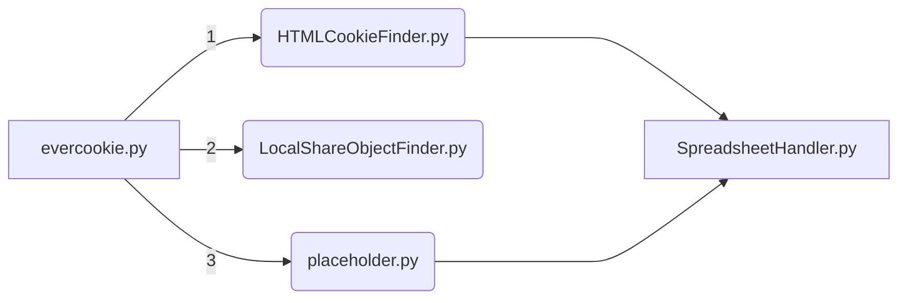

# equable-destruction
 > v. 20230213

> author: github@southwick.io
 

## Overview
### This app is under development.
 Evercookie related research and scripts to find evercookies.
 
 Research was framed around [OP's creation](https://github.com/samyk/evercookie).
 
Run **evercookie.py**.

## Script Order

## Script Descriptions
 1. HTMLCookieFinder.py - Checks for simple HTML cookies from Chrome and Firefox. Apt and Snap examples.
 2. LocalShareObjectFinder.py - Checks for the presence of LSOs, but doesnt print to spreadsheet since LSOs are deprecated.

## Outside dependencies
 1. openpyxl

## Pre-runtime
 1. All scripts are written for Ubuntu.
 2. Review each script before first runtime and make changes as needed.
 3. All scripts are written for one profile.
 4. evercookie.py needs to be run as sudo if you want LocalShareObjectFinder.py to have permissions to check everywhere for LSO objects. Otherwise, its just looking for user LSO objects.

## Todo
 1. Port for Windows and MacOS
