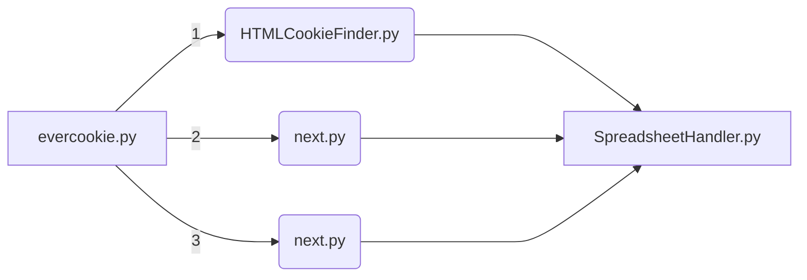

# equable-destruction
 > v. 20230211

 Evercookie related research and scripts.
 Research was framed around [OP's creation](https://github.com/samyk/evercookie).
Run **evercookie.py**

## Script Order

## Script Descriptions
 1. html-cookie-finder.py - Checks for simple HTML cookies from Chrome and Firefox. Apt and Snap examples.

## Outside dependencies
 1. openpyxl

## Pre-runtime
 1. All scripts are written for Ubuntu.
 2. Review each script before first runtime and make changes as needed.
 3. All scripts are written for one profile.