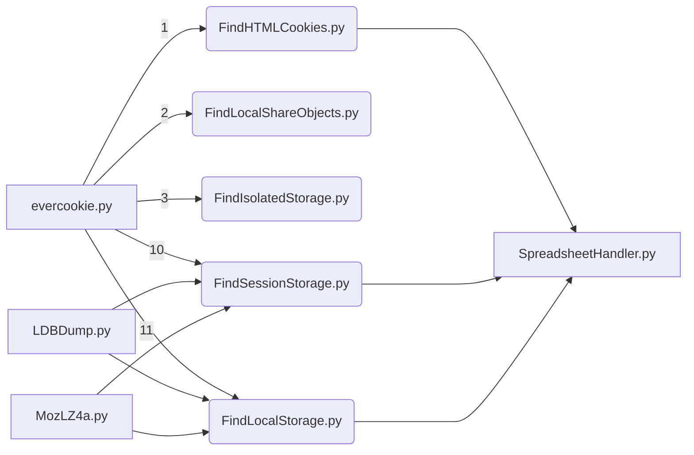

# Equable Destruction
> v. 20230220

> author: @southwickIO
<br>

## Overview
### This app is under development.
 Evercookie related research and scripts to find evercookies.
<br>

Research was framed around [OP's creation](https://github.com/samyk/evercookie).
<br>

## Current task:
- [ ] Working on FindSessionStorage.py and getting LDBDump.py nd MozLZ$a.py incorporated.
- [ ] Figure out why spreadsheet handler isn't updating correctly. Scope?

## Script Order


## Script Descriptions
 1. FindHTMLCookies.py - Checks for simple HTML cookies from Chrome and Firefox. Apt and Snap examples.
 2. LocalShareObjectFinder.py - Checks for the presence of LSOs, but doesnt print to spreadsheet since LSOs are deprecated.
 3. FindIsolatedStorage.py - Supposed to check for the presense of Isolated Storage. It was a Silverlight feature and there is no indication that Edge uses this.
 4. FindSessionStorage.py - Check for the presense of session storage artifacts and prints to ../evercookies,xlsx

## Dependencies
 1. openpyxl
 2. lz4

## Notable file paths (Ubuntu 22.04)
1. ~/.config/google-chrome/\<profile\>/Cookies
2. /snap/firefox/common/.mozilla/firefox/\<profile\>.default/
3. ~/.config/google-chrome/\<profile\>/LocalStorage
4. ~/.config/microsoft-edge/\<profile\>/LocalStorage

## evercookie.py usage
 1. All scripts are written for Ubuntu file system.
 2. All scripts are written for one profile/user.
 3. Chromium related browsers were installed with dpkg
 4. Firefox was installed with snap
 5. Review each script before first runtime and make changes as needed.
 6. evercookie.py needs to be run as sudo if you want LocalShareObjectFinder.py to have permissions to check everywhere for LSO objects. Otherwise, its just looking for user LSO objects.
 7. Be sure to change your firefox profile in the file paths. It doesn't have a standard and the one use for this script was ```qkwknqsj.default```. Yours will be different

 ## Helpful Commands
 1. `sudo grep -rnw . -e "<search term>"` - will return any file in the current directory that has \<search term\>

## Tasks
- [x] evercookie.py (Main)
- [x] Standard HTTP Cookies
- [x] Flash Local Shared Objects
- [x] Silverlight Isolated Storage
- [ ] CSS History Knocking
- [ ] Storing cookies in HTTP ETags (Backend server required)
- [ ] Storing cookies in Web cache (Backend server required)
- [ ] HTTP Strict Transport Security (HSTS) Pinning (works in Incognito mode)
- [ ] window.name caching
- [ ] Internet Explorer userData storage
- [x] HTML5 Session Storage
- [ ] HTML5 Local Storage <-----
- [ ] HTML5 Global Storage <-----
- [ ] HTML5 Database Storage via SQLite
- [ ] HTML5 Canvas (Backend server required)
- [ ] HTML5 IndexedDB
- [ ] Java JNLP PersistenceService
- [ ] Java exploit CVE-2013-0422
- [ ] Update FindHTMLCookies.py to include Microsoft Edge
- [ ] Update scripts to include Snap and Dpkg for all tested browsers
- [ ] Port for Windows and MacOS
- [ ] Create import module of filepaths a user can draw from
- [ ] Look at extension storage

## Resources
1. [View, edit, and delete cookies in Microsoft Edge](https://learn.microsoft.com/en-us/microsoft-edge/devtools-guide-chromium/storage/cookies)
2. [Microsoft Edge Developers](https://learn.microsoft.com/en-us/microsoft-edge/developer/)
3. [Chrome Developers](https://developer.chrome.com/docs/)
4. [Chromium Developers](https://www.chromium.org/developers/)
5. [Firefox Developers](https://developer.mozilla.org/en-US/)
6. [Microsoft Edge Developers: Store data on the device](https://learn.microsoft.com/en-us/microsoft-edge/progressive-web-apps-chromium/how-to/offline)
7. [Chromium Session Storage and Local Storage](https://www.cclsolutionsgroup.com/post/chromium-session-storage-and-local-storage)
8. [Hang on! That’s not SQLite! Chrome, Electron and LevelDB](https://www.cclsolutionsgroup.com/post/hang-on-thats-not-sqlite-chrome-electron-and-leveldb)
9. [Microsoft Developes: Isolated Storage](https://learn.microsoft.com/en-us/dotnet/standard/io/isolated-storage)
10. [Firefox Storage Inspector](https://firefox-source-docs.mozilla.org/devtools-user/storage_inspector/)
